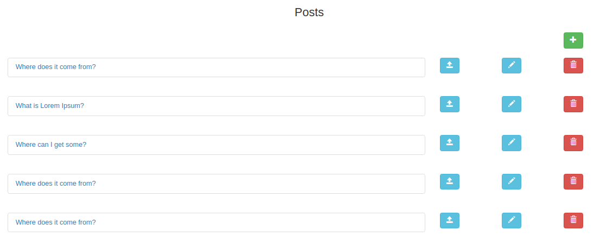

# CRUD
## Django CRUD app    

This is a simple Django CRUD application that allows to create, retrieve, update and delete a post. If you are new to the filed of of  Django web development, this is a good way to start.

The inerface is as shown


To get it running on your local machine, follow the steps below:

1. Run the commands below in your terminal:
```bash
$ git clone https://github.com/john-bagiliko/CRUD.git 
```
2. 
```bash
$ cd CRUD
```
3. Install the requirements with the command below:

```bash
$ pip install -r requirements.txt
```
4. Run the development server with

```bash
$ python manage.py runserver
```

5. Launch your browser and navigate to http://localhost:8000/
